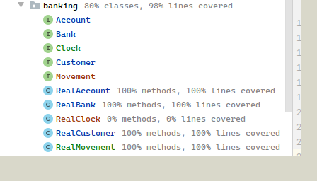
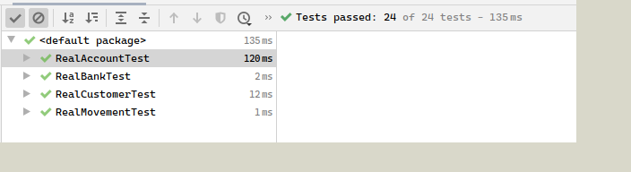

# Mocking and TDD  
  * [Contract](https://github.com/DBois/BankContract)  
  * [Backend](https://github.com/DBois/Assigment_1_Mocking_TDD)  
Our proposed solution of this [assignment](https://datsoftlyngby.github.io/soft2020spring/resources/85f09312-01-assignment-mocking.pdf).

## Test coverage and results

### Our test coverage of the classes used for the project

### Our test results when run

