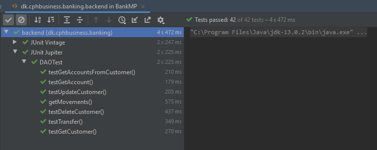

# Mocking and TDD  
  * [Contract](https://github.com/DBois/BankContract)  
  * [Backend](https://github.com/DBois/Assigment_1_Mocking_TDD) 
  * [Frontend](https://github.com/DBois/BankFrontend) 
  
## Assignment 5. Frontend Test  
Our proposed solution of [this assignment](https://datsoftlyngby.github.io/soft2020spring/resources/4c3f949c-05-assignment-frontend.pdf)    

First off all edit the configuration to have `-ea -Dwebdriver.chrome.driver="C:\chromedriver.exe"` in VM options for the test you're running.

Inside the `dk.cphbusiness.banking.backend.selenium` package, you'll find all of our selenium tests.  

Check out our [frontend](https://github.com/DBois/BankFrontend)  written in Svelte.
  
## Assignment 4. REST Integration Testing
Our proposed solution of [this assignment](https://datsoftlyngby.github.io/soft2020spring/resources/5988f3c5-04-assignment-rest.pdf) 

Inside the `dk.cphbusiness.banking.backend.rest` package, you will find all REST endpoints implemented, which is separated by different entities + root of JAX-RS application `RESTApplication`

Inside the `dk.cphbusiness.banking.backend.rest` package, you will find all tests for the respective REST classes. 

Inside the `dk.cphbusiness.banking.backend.facade` package you will find facades which the REST endpoints call 

## Assignment 3. Database Testing  
Our proposed solution of [this assignment](https://datsoftlyngby.github.io/soft2020spring/resources/db4fc3df-03-assignment-database.pdf)  

Inside the `src.main.java.dk.cphbusiness.banking.backend.datalayer` package, you will find an interface for the `DataAccessObject`, and implementation of select methods in the `DAO` class and a `DBConnector` class to establish a connection to the database.  

Inside the `src.main.java.dk.cphbusiness.banking.backend.datalayer` you will find a `TestDatabaseUtility` which holds utility methods used for testing. A `DatabaseTest` class which is used to test the connection to the database and creation and deletion of the database. And finally the `DAOTest` class, which tests methods from our `DAO` class.

Results for the tests:  

## Assignment 1. Test coverage and results

Our proposed solution of [this assignment](https://datsoftlyngby.github.io/soft2020spring/resources/85f09312-01-assignment-mocking.pdf).

### Our test coverage of the classes used for the project

### Our test results when run

